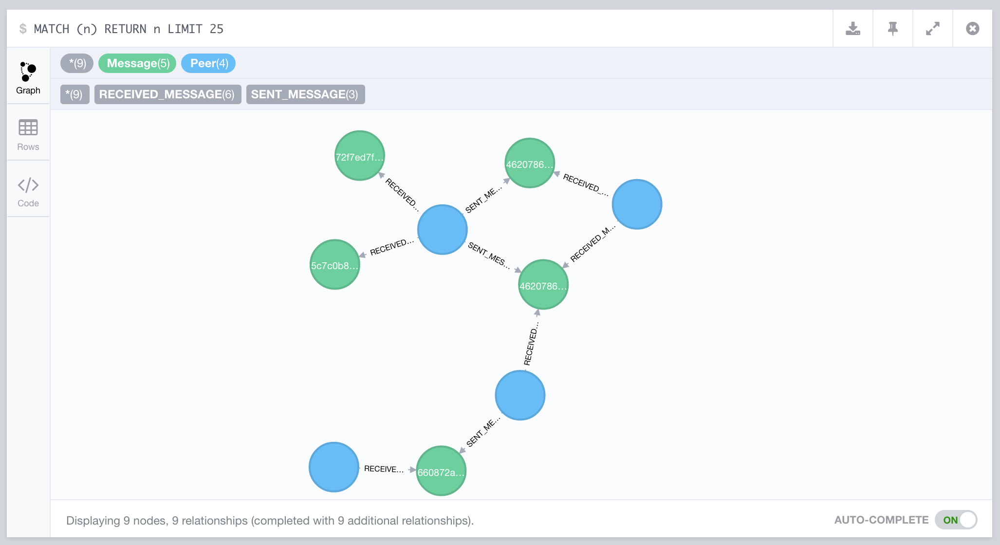

# Tolerance Example Symfony Service

This is an example application that is used for demos of real-life usage of [Tolerance](http://tolerance.io) features.

The Docker Compose configuration is created to run 2 different services and shows to interest of the MessageIdentifier
component. For instance, if you click on the "Embedded page" link at the home page of the service1, it will call the
service2, that will itself call the GitHub API.

You'll then be able to see the following log graph of the requests in the Neo4j database:


_Note: A proper message viewer is currently under development._

## Getting started with Docker

You can simply use the Docker image:
```
docker-compose up -d
```

If you are using [dock-cli](https://github.com/inviqa/dock-cli) (or any manual DNS integration with DNSDock), you'll be
able to access:

- The first service
  http://toleranceexamplesymfonyservice_service1.docker

- Neo4j browser
  http://neo4j.docker:7474

## Manually

Well, that's a classic [Symfony application](http://symfony.com/doc/current/quick_tour/the_big_picture.html) :)
